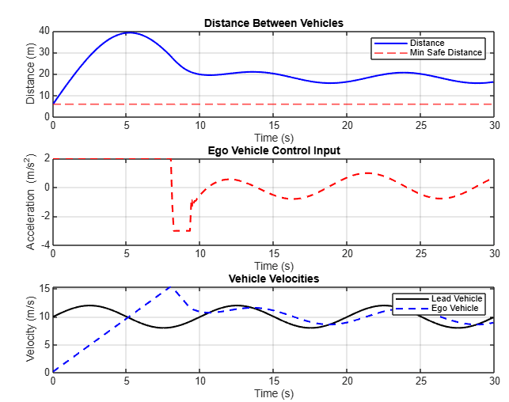
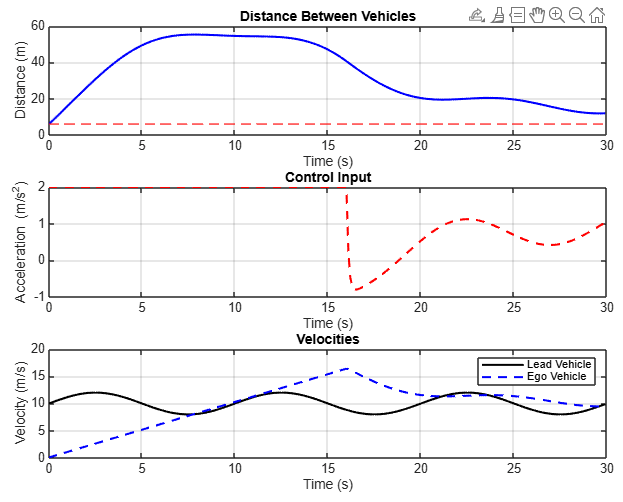
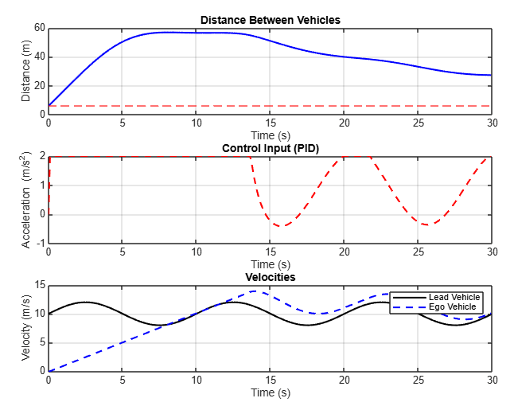
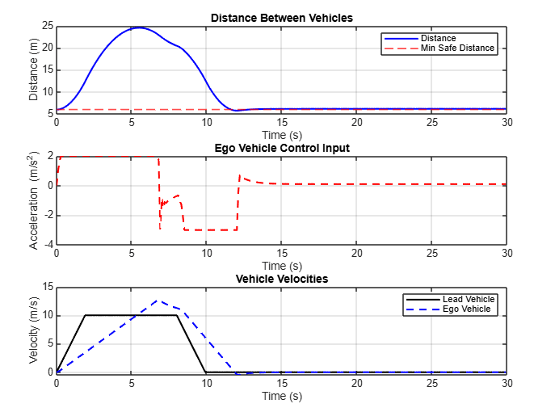
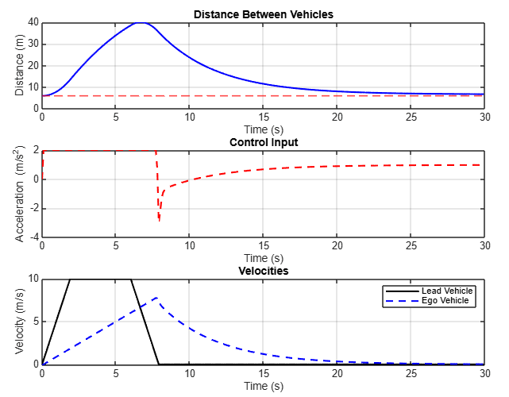
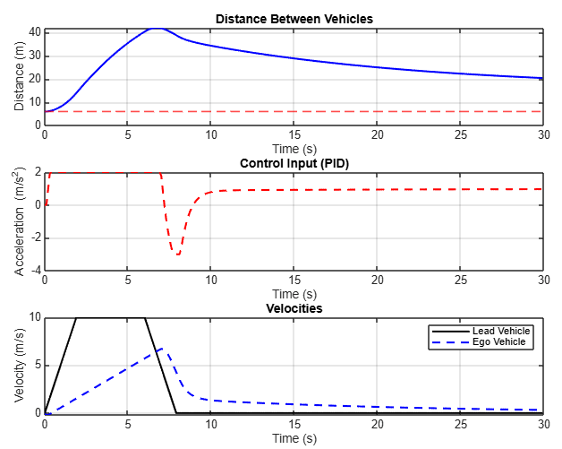

# Adaptive Cruise Control Using MPC, LQR, and PID

This repository presents a MATLAB-based simulation of Adaptive Cruise Control (ACC) for an ego vehicle following a lead vehicle with varying velocity profiles. Three control strategies are implemented and compared:

- **Model Predictive Control (MPC)**
- **Linear Quadratic Regulator (LQR)**
- **Proportional-Integral-Derivative (PID)**

## 📁 Project Structure

The project contains:

- 📷 **Images**: Performance plots of each controller under different lead vehicle scenarios (`*.png`)
- 🎞️ **Animations**: Recorded simulations of vehicle behavior over time (`*.avi`)
- 📄 **Report**: A LaTeX document (`main.tex`) describing the models, controllers, and analysis

## 📌 System Overview

The longitudinal dynamics of the ego vehicle are modeled using a discrete-time double integrator with rolling resistance. A dynamic reference velocity is computed based on the lead vehicle's speed and inter-vehicle distance to ensure safe following.

### Discrete System Model

\[
x_{k+1} = A_d x_k + B_d u_k + E_d
\]

With:
- \( A_d = \begin{bmatrix} 1 & 0.1 \\ 0 & 1 \end{bmatrix} \)
- \( B_d = \begin{bmatrix} 0 \\ 0.1 \end{bmatrix} \)
- \( E_d = \begin{bmatrix} 0 \\ -0.0981 \end{bmatrix} \)

## ⚙️ Controllers Implemented

### 🔷 Model Predictive Control (MPC)

- Prediction horizon: 10 steps
- Control horizon: 3 steps
- Cost weights:  
  - State: \( Q = \text{diag}(4, 2) \)  
  - Input: \( R = 0.1 \), \( \Delta R = 0.1 \)
- Acceleration bounds: \([-3, 2]\) m/s²

### 🔶 Linear Quadratic Regulator (LQR)

- Cost weights:  
  - State: \( Q = \text{diag}(10, 1) \)  
  - Input: \( R = 0.5 \)
- Control input clipped between \([-3, 2]\) m/s²

### 🔸 PID Controller

- Gains: \( K_p = 0.4 \), \( K_i = 0.05 \), \( K_d = 0.8 \)
- Uses relative distance error
- Derivative smoothing and saturation applied

## 📊 Simulation Scenarios

### Case 1: Oscillating Lead Velocity
- \( v_{\text{lead}}(t) = 10 + 2 \sin(2\pi \cdot 0.1 \cdot t) \)
- **MPC** maintains smooth tracking and spacing
- **LQR** reacts quickly but can get too close
- **PID** lags and overshoots

### Case 2: Lead Vehicle Comes to Stop
- Ramp-up, cruise, and full stop profile
- Performance compared for all controllers

## 🖼️ Visual Results

## Case 1: Oscillating Lead Vehicle Velocity

### MPC Response

<video width="600" controls>
  <source src="pics/mpc_animation_case1.avi" type="video/avi">
  Your browser does not support the video tag.
</video>

### LQR Response

<video width="600" controls>
  <source src="pics/lqr_animation_case1.avi" type="video/avi">
  Your browser does not support the video tag.
</video>

### PID Response

<video width="600" controls>
  <source src="pics/pid_animation_case1.avi" type="video/avi">
  Your browser does not support the video tag.
</video>

## Case 2: Lead Vehicle Comes to a Stop

### MPC Response

<video width="600" controls>
  <source src="pics/mpc_animation_case2.avi" type="video/avi">
  Your browser does not support the video tag.
</video>

### LQR Response

<video width="600" controls>
  <source src="pics/lqr_animation_case2.avi" type="video/avi">
  Your browser does not support the video tag.
</video>

### PID Response

<video width="600" controls>
  <source src="pics/pid_animation_case2.avi" type="video/avi">
  Your browser does not support the video tag.
</video>
